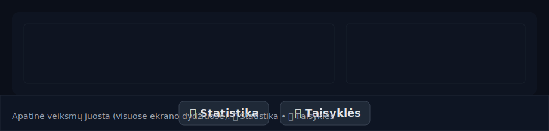

# Wordle LT (React + Vite + TS + Tailwind)

Lietuviškas Wordle tipo žaidimas pagal ADR-001: 5 raidžių žodis, 6 bandymai, ekrano ir fizinė klaviatūra (su lietuviškomis raidėmis ąčęėįšųūž), LT klaidų pranešimai, localStorage, testai. Tikslinis žodis parenkamas atsitiktinai kiekvienam naujam žaidimui. Ekraninė klaviatūra turi atskirą LT diakritikų eilutę; fizinė klaviatūra priima LT raides. Įvestis saugoma nekeičiant diakritikų (žr. `normalizeInput`).

## Reikalavimai

- Node.js 18+
- npm 9+

## Diegimas ir paleidimas

1. Įdiek priklausomybes:
   ```bash
   npm install
   ```
2. Paleisk vystymo serverį:
   ```bash
   npm run dev
   ```
3. Atidaryk naršyklę adresu, kurį nurodo Vite (pvz., http://localhost:5173).

## Scriptai

- `npm run dev` – paleidžia Vite dev serverį.
- `npm run build` – TypeScript kompiliacija ir Vite build.
- `npm run preview` – statinio build peržiūra.
- `npm test` – Vitest (unit ir RTL integraciniai testai).
- `npm run test:ui` – Playwright E2E (kai bus pridėta).
- `npm run format` – Prettier formatavimas.

## Projekto struktūra

```
/ (repo šaknis)
├─ docs/ADR-001.md           # Architektūros sprendimo įrašas
├─ src/
│  ├─ components/
│  │  ├─ Board.tsx           # 5x6 lenta
│  │  ├─ Keyboard.tsx        # ekrano klaviatūra
│  │  ├─ RulesModal.tsx      # taisyklių modalas
│  │  ├─ StatsModal.tsx      # statistikos modalas
│  │  ├─ WinNameModal.tsx    # vardo įvedimo modalas laimėjus
│  │  └─ Confetti.tsx        # konfeti animacija
│  ├─ domain/
│  │  ├─ logic.ts            # normalizeInput, validateGuess, scoreGuess, pickRandomTarget/pickDailyTarget, ...
│  │  ├─ words/
│  │  │  ├─ solutions.json      # lygiai 100 lietuviškų 5 raidžių žodžių (su diakritika)
│  │  │  └─ allowed.json        # leidžiamų žodžių superset (šiuo metu = solutions)
│  ├─ App.tsx
│  ├─ __tests__/             # visi testai vienoje vietoje (unit, component, integration)
│  │  ├─ logic.test.ts
│  │  ├─ storage.test.ts
│  │  ├─ storage.extra.test.ts
│  │  ├─ storage.leaderboard.test.ts
│  │  ├─ Board.test.tsx
│  │  ├─ StatsModal.test.tsx
│  │  ├─ StatsModal.leaderboard.test.tsx
│  │  ├─ WinNameModal.test.tsx
│  │  └─ App.test.tsx
│  ├─ index.css              # Tailwind stiliai
│  └─ main.tsx
├─ vite.config.ts
├─ postcss.config.cjs
├─ tsconfig.json
├─ vitest.setup.ts
├─ package.json
└─ README.md
```

## ADR-001 atitikimas

- **Technologijos**: React, Vite, Tailwind, TypeScript, Vitest, RTL. (Playwright – planuojamas)
- **MVP funkcijos**:
  - 5 raidžių žodis, 6 bandymai.
  - Ekrano ir fizinė klaviatūra (leidžiamos LT raidės ąčęėįšųūž; diakritikos išlaikomos, nepašalinamos).
  - LT klaidų pranešimai, taisyklių modalas (užsidaro paspaudus bet kur).
  - Statistika juostoje: laikmatis (startas nuo pirmo įvedimo), „geriausias laikas“ (localStorage), serijos (streak) ir bandymų pasiskirstymas.
  - **Leaderboard**: laimėjus žaidėjas gali įvesti vardą ir patekti į lyderių lentelę (localStorage). Rodomi top 10 rezultatų pagal Hard Mode, bandymų skaičių, laiką ir datą.
  - Per‑spėjimo laikmatis veikia tik įjungus Hard Mode; įprastame režime laikmatis nenaudojamas.
  - Haptika (vibracija) neteisingo/ypatingo įvedimo atvejais.
  - localStorage su `version` ir dienos rollover (00:00, vietinė TZ) pagal `baseEpochDay()`.
  - Tikslinis žodis: atsitiktinis kiekvienam naujam žaidimui. Istorinis `pickDailyTarget` paliktas tik testams/regresijai.
- **Domeno modelis**: `Word`, `Guess`, `FeedbackCell`, `AttemptResult`, `GameState` + funkcijos `validateGuess`, `scoreGuess`, `isWin`, `pickRandomTarget`, `pickDailyTarget` (testams), `normalizeInput`.
- **A11y**: `aria-live` toasts, klaviatūros navigacija, modalas su `aria-modal`.

## Testavimas

- Visi testai: `src/__tests__/`.
- Unit (Vitest): `logic.test.ts` – `normalizeInput`, `validateGuess`, `scoreGuess` (dvigubos raidės), `pickRandomTarget`, `pickDailyTarget`, `baseEpochDay`.
- Unit (storage): `storage.test.ts`, `storage.extra.test.ts`, `storage.leaderboard.test.ts` – stats agregavimas, serijos logika, saugojimo guard'ai, leaderboard funkcionalumas.
- Component: `Board.test.tsx` – eilučių/plytelių kiekis, flip/pop/shake animacijų klasės; `StatsModal.test.tsx` – KPI skaičiai, uždarymas per Escape/overlay; `StatsModal.leaderboard.test.tsx` – leaderboard atvaizdavimas; `WinNameModal.test.tsx` – vardo įvedimo modalas.
- Integraciniai (RTL): `App.test.tsx` – įvedimas per ekraninę klaviatūrą, trumpas žodis, sėkmingas žaidimo scenarijus ir „Rekordas" persistencija po „Naujas žaidimas".
- E2E (Playwright): planuojama pridėti (laimėjimas, pralaimėjimas, localStorage, rollover, mobilus viewport, copy-to-clipboard).

Paleisti testus:
```bash
npm test
```

Paleisti su padengimu (coverage):
```bash
npm test -- --coverage
```

Pastabos:
- `vitest.setup.ts` aprūpina `requestAnimationFrame` ir `HTMLCanvasElement.getContext` maketus stabilumui (jsdom aplinkoje), kad komponentai su animacijomis veiktų testuose.
- Konfeti testavimas: canvas kontekstas testuose yra imituojamas; tikrinant blukimą (fade‑out) stebimas `ctx.globalAlpha` setter’io kvietimas, o kad animacija būtų deterministinė – valdomi `requestAnimationFrame` ir `performance.now`.
- Globalūs coverage slenksčiai: `lines:100`, `statements:100`, `functions:100`, `branches:95` (žr. `vitest.config.ts`). `src/components/Confetti.tsx` yra išimtis iš coverage dėl jsdom/canvas apribojimų; jo elgsena dengiama tikslingais testais su maketais.

Papildomi testų stabilumo sprendimai
------------------------------------

- `navigator.vibrate` jsdom’e nėra – testuose dedame stabilų stub’ą (`Object.defineProperty(navigator, 'vibrate', { value: vi.fn(), configurable: true, writable: true })`) prieš `spyOn`.
- React 19 perspėjimas „Expected static flag was missing“ nutildomas `vitest.setup.ts` per laikiną `console.error` spy (kiti error’ai neišjungiami).
- `StatsModal` KPI grid’as apgaubtas semantine grupe `role="group" aria-label="KPI"` tikslesniems testų užklausoms ir a11y semantikai.

## Funkcijos

- Dalinimasis rezultatais: mygtukas „Kopijuoti rezultatą" po žaidimo – 5×6 emoji tinklelis + nuoroda, toast „Rezultatas nukopijuotas!".
- Statistika: `gamesPlayed`, `wins`, `win%`, `currentStreak`, `maxStreak`, bandymų pasiskirstymo histograma + mini kalendorius (paskutinių ~30 d., 5 savaičių tinklelis su LT savaitės dienų žymėmis).
- **Leaderboard**: laimėjus atsiranda vardo įvedimo modalas. Žaidėjas gali įvesti vardą (iki 20 simbolių) ir patekti į lyderių lentelę. Leaderboard rodomas statistikos modale su top 10 rezultatų, surūšiuotų pagal Hard Mode, bandymų skaičių, laiką ir datą.
- Hard Mode: perjungiklis „⚡ Sunku" antraštėje (įjungus – raudonas fonas su žiedu). Įjungus – privaloma naudoti gautas užuominas (žalios fiksuotos, geltonos privalomos), taip pat įsijungia per‑spėjimo laikmatis (numatytai 20 s). Išjungus Hard Mode laikmatis nestartuojamas ir nerodomas. A11y: `aria-pressed`, `aria-label`, dinaminis `title`.
- Pergalių konfeti: laimėjus paleidžiama lengva konfeti animacija (~2.5s).
- Modalai: 
  - Taisyklės/Statistika – užsidaro paspaudus bet kur (portalai į `document.body`) ir su Escape.
  - Vardo įvedimo modalas – atsiranda laimėjus, leidžia įvesti vardą leaderboard'ui.
  - A11y: `aria-modal`, status toasts.

## UI animacijos

- **Klaviatūros paspaudimas**: `.key-btn` turi ripple + subtilų mastelio pokytį (CSS keyframes). Greita ir GPU-draugiška.
- **Statistikos modalo atidarymas**: overlay fade-in (`overlay-in`), kortelė scale+slide in (`card-in`).
- **Statistikos modalo uždarymas**: šiuo metu momentinis (stabilumui). Outro animacija bus grąžinta vėliau, valdomas `animationend` įvykis, kad nebestrigtų.
- **Histogramos juostos**: `inline-size` auga su `transition` atidarius modalą; testuose plotis tikrinamas per inline `style` ant `.bar-grow`. Pločio formulė supaprastinta ir be nepasiekiamų šakų: `w = Math.max(6, round(v/maxAttempts*100))`, kur `maxAttempts` visada ≥ 1.
- **Hard Mode mygtukas**: subtilus pulsavimas (`.btn-pulse`) kai režimas įjungtas.
- **KPI skaitikliai**: sklandus „count-up“ (`AnimatedNumber`) su `requestAnimationFrame` ir ease-out.
- **Apatinė juosta**: stipresnis `backdrop-blur` ir `shadow` dėl vizualios hierarchijos.

### A11y ir našumas

- Animacijos paremtos CSS/RAF; vengiam „layout thrash“. Naudojamos transform/opacity.
- Gerbiam `aria` atributus modaluose; KPI turi `aria-live="polite"`.
- Galima pridėti `prefers-reduced-motion` taisykles, jei reikės sumažinti judesį jautriems naudotojams.
 - `StatsModal` KPI sekcija apgaubta `role="group"` su `aria-label="KPI"` tikslesniems testų užklausoms ir a11y semantikai.

### Problemos ir sprendimai

- **Matomas juodas ekranas atidarius Statistiką**: tai gali reikšti, kad kortelė nepasirodo virš overlay.
  - Sprendimas: pakelti z-indeksus (`z-[9999]` overlay, `z-[10000]` kortelė), patikrinti konsolės klaidas.
  - Laikinas workaround: išjungti uždarymo animaciją (palikta šiame commit’e) – modalo uždarymas momentinis ir stabilus.

### Apatinė veiksmų juosta

- „📊 Statistika“ ir „📜 Taisyklės“ yra nuolat pasiekiami sticky apatinėje juostoje visuose ekrano dydžiuose.
- Juosta turi pusiau permatomą foną, `backdrop-blur` ir subtilų viršutinį rėmelį (`border-t`).
- Antraštėje palikti tik „Naujas žaidimas“ ir „⚡ Sunku“.



## Ikonų politika

- Naudojamos paprastos emoji piktogramos, papildančios tekstą, bet jo nepakeičiančios.
- Pavyzdžiai: `📊 Statistika`, `📜 Taisyklės`, `⚡ Sunku`.
- Prieinamumas: tekstinės etiketės visada paliekamos; būsenoms naudojami `aria-pressed`, `aria-label`.

## Pastabos

- Jei gauni saugumo perspėjimus iš `npm audit`, gali naudoti `npm audit fix` (ar `--force` – gali būti lūžtančių pakeitimų).
- Spalvų alternatyvos neregintiesiems – galima pridėti per Tailwind temą (papildomas režimas).

## Licencija

MIT (ar nurodyk kitą, jei reikia).
